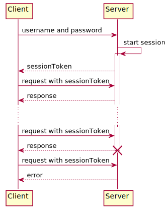
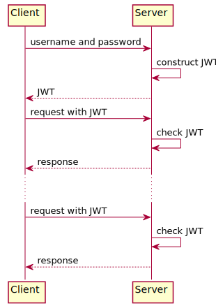
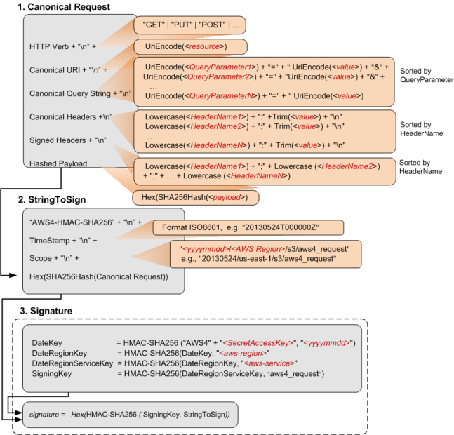
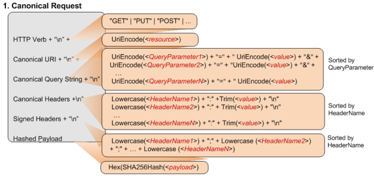

<!-- $theme: default -->

# JSON Web Tokens

Luc Engelen

---

# Myself

* 2006 - 2014: Researcher at TU/e
* 2014 - 2016: iOS and Java developer at ISAAC
* 2016 - present: (Mostly) Java developer at Kabisa

---

# Kabisa

* Web apps - Hybrid mobile apps
* Ruby on Rails - Java - Elixir
* Backbone - Marionette - React
* Agile - TDD - BDD
* Weert - Amsterdam

---

# What's the problem?

---


---



---

**<span style="color: red">eyJhbGciOiJIUzUxMiJ9</span>.<span style="color: fuchsia">eyJleHAiOjE0NzYyOTAxNDksInN1YiI6IjEifQ</span>.<span style="color: blue">mvJEWu3kxm0WSUKu-qEVTBmuelM-2Te-VJHEFclVt_uR89ya0hNawkrgftQbAd-28lycLX2jXCgOGrA3XRg9Jg</span>**

---

<pre style="color:red">
{
  "alg": "HS512"
}
</pre>

<pre style="color:fuchsia">
{
  "sub": "1",
  "admin": false
}
</pre>

<pre style="color:blue">
HMACSHA256(
  base64UrlEncode(header) + "." +
  base64UrlEncode(payload),
  secret
)
</pre>

---



---

# Where to leave these tokens?

* In a cookie?

* In a header?

---

# Intermezzo: XSS and CSRF

## XSS

Someone is able to have their scripts executed as part of your web application.


```
<% String eid = request.getParameter("eid"); %> 
	...
	Employee ID: <%= eid %>
```

---

# Intermezzo: XSS and CSRF

## CSRF

Someone else's web application secretly lets its visitors perform actions with your web application due to cookies still present from previous visits.


```
<form action="http://bank.com/transfer.do" method="POST">
<input type="hidden" name="acct" value="MARIA"/>
<input type="hidden" name="amount" value="100000"/>
<input type="submit" value="View my pictures"/>
</form>
```

---

# Intermezzo: XSS and CSRF

```
print "<html>"
print "Latest comment:"
print database.latestComment
print "</html>"
```

---

# Intermezzo: XSS and CSRF

```

```

---

# Where to leave these tokens?

* In a cookie?

* In a header?

---

# Defence against CSRF is straightforward and durable

1. Check the *origin* and *referer* headers
2. Check for some other header you're setting, such as *X-Requested-With*

See www.owasp.org

---

# What happens when I change my password?

<pre style="color:red">
{
  "alg": "HS512"
}
</pre>

<pre style="color:fuchsia">
{
  "sub": "1",
  "admin": false
}
</pre>

<pre style="color:blue">
HMACSHA256(
  base64UrlEncode(header) + "." +
  base64UrlEncode(payload),
  secret
)
</pre>

---

# When should a JWT expire?

* As soon as possible, to prevent misuse for long periods
* As late as possible, so that users don't have to re-authenticate all the time

---

# When should a JWT expire?

* Introduce a short-lived token used for authentication per request
* Introduce a long-lived token used to generate a new short-lived token when needed

The long-lived token is used in combination with a blacklist of retracted tokens

---

# Should I accept all "valid" JWTs?

* No, because "none" is a valid algorithm
* The key you use to check the signature should match the algorithm

See https://auth0.com/blog/critical-vulnerabilities-in-json-web-token-libraries/

---

# What happens when I delete my account?

<pre style="color:red">
{
  "alg": "HS512"
}
</pre>

<pre style="color:fuchsia">
{
  "sub": "1",
  "admin": false
}
</pre>

<pre style="color:blue">
HMACSHA256(
  base64UrlEncode(header) + "." +
  base64UrlEncode(payload),
  secret
)
</pre>

---

# How do I apply this idea to server-to-server communication?

---

```
POST /api/session HTTP/1.1
Host: 54.194.126.161
Connection: keep-alive
Content-Length: 31
Accept: */*
Origin: http://54.194.126.161
X-Requested-With: XMLHttpRequest
User-Agent: Mozilla/5.0 (Macintosh; Intel Mac OS X 10_12_0) AppleWebKit/537.36 (KHTML, like Gecko) Chrome/53.0.2785.143 Safari/537.36
Content-Type: application/json
Referer: http://54.194.126.161/login
Accept-Encoding: gzip, deflate
Accept-Language: en-US,en;q=0.8,nl;q=0.6
Cookie: JSESSIONID=37AA2A85693E255315D532C845FDE47B
{"username":"a","password":"a"}
```

---


http://docs.aws.amazon.com/AmazonS3/latest/API/sig-v4-header-based-auth.html

---



---



---

```GET /test.txt HTTP/1.1
GET ?lifecycle HTTP/1.1
Host: examplebucket.s3.amazonaws.com
Authorization: SignatureToBeCalculated
x-amz-date: 20130524T000000Z 
x-amz-content-sha256:e3b0c44298fc1c149afbf4c8996fb92427ae41e4649b934ca495991b7852b855
```

```
GET
/
lifecycle=
host:examplebucket.s3.amazonaws.com
x-amz-content-sha256:e3b0c44298fc1c149afbf4c8996fb92427ae41e4649b934ca495991b7852b855
x-amz-date:20130524T000000Z

host;x-amz-content-sha256;x-amz-date
e3b0c44298fc1c149afbf4c8996fb92427ae41e4649b934ca495991b7852b855
```

---

# See for yourself

https://github.com/ljpengelen